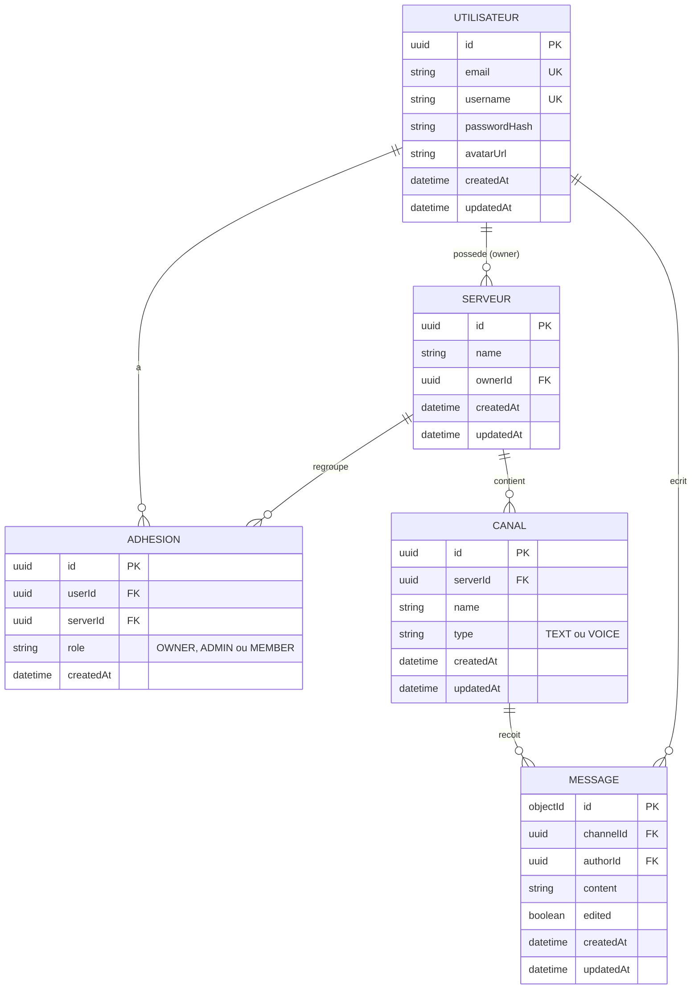

# Modélisation des données — MCD / MLD

Ce document remplace le placeholder vide `docs/mcd.png` en attendant un export image
(à générer depuis le diagramme Mermaid ci-dessous, par ex. via mermaid.live).

Périmètre : uniquement les données **persistées**. La présence en ligne et la
signalisation WebRTC vivent dans Redis de façon éphémère et ne font pas partie
du modèle de données durable → volontairement hors MCD/MLD.

---

## 1. MCD (Merise) — entités, associations, cardinalités

**Entités**
- `UTILISATEUR` (id, email, username, passwordHash, avatarUrl, createdAt, updatedAt)
- `SERVEUR` (id, name, createdAt, updatedAt)
- `CANAL` (id, name, type [TEXT|VOICE], createdAt, updatedAt)
- `MESSAGE` (id, content, edited, createdAt, updatedAt) — stocké dans MongoDB (NoSQL), pas dans le MLD relationnel ci-dessous

**Associations et cardinalités**
| Association | Entité 1 | Card. | Entité 2 | Card. | Attributs portés |
|---|---|---|---|---|---|
| POSSEDE | UTILISATEUR | (0,n) | SERVEUR | (1,1) | — |
| ADHESION | UTILISATEUR | (0,n) | SERVEUR | (0,n) | `role` (OWNER, ADMIN, MEMBER) |
| CONTIENT | SERVEUR | (1,1) | CANAL | (0,n) | — |
| RECOIT | CANAL | (1,1) | MESSAGE | (0,n) | — |
| ECRIT | UTILISATEUR | (1,1) | MESSAGE | (0,n) | — |

Lecture : un serveur a exactement un propriétaire (owner) mais un utilisateur peut
posséder plusieurs serveurs. Un utilisateur peut être membre de plusieurs serveurs
et un serveur a plusieurs membres (association porteuse `ADHESION` avec le rôle).

## 2. Diagramme (Mermaid, équivalent visuel MLD)



## 3. MLD — traduction relationnelle (PostgreSQL, déjà implémentée dans `backend/prisma/schema.prisma`)

```
UTILISATEUR (id PK, email UK, username UK, passwordHash, avatarUrl, createdAt, updatedAt)

SERVEUR (id PK, name, ownerId FK → UTILISATEUR.id, createdAt, updatedAt)

CANAL (id PK, serverId FK → SERVEUR.id, name, type, createdAt, updatedAt)

ADHESION (id PK, userId FK → UTILISATEUR.id, serverId FK → SERVEUR.id, role, createdAt)
    UNIQUE(userId, serverId)
```

Ce schéma correspond exactement au `schema.prisma` déjà présent sur `dev` — aucune
divergence à corriger, juste la migration Prisma à exécuter (voir TODO).

### Message (MongoDB / Mongoose, hors MLD relationnel)

```
Message {
  _id: ObjectId
  channelId: UUID (référence logique vers CANAL.id, pas de FK réelle cross-DB)
  authorId: UUID (référence logique vers UTILISATEUR.id)
  content: String
  attachments: [String]   // urls, optionnel
  edited: Boolean (default false)
  createdAt: Date
  updatedAt: Date
}
```

Le choix Mongo pour les messages (au lieu de Postgres) est déjà acté dans le
docker-compose / config existants : gros volume d'écritures, pas besoin de
jointures relationnelles strictes sur cette entité.

## 4. Hors périmètre actuel (à ne pas coder maintenant)

 Le MCD/MLD ci-dessus couvre exactement ce que `docker-compose.yml`,
`schema.prisma` et les sockets `/chat` `/voice` déjà en place sont censés servir.
